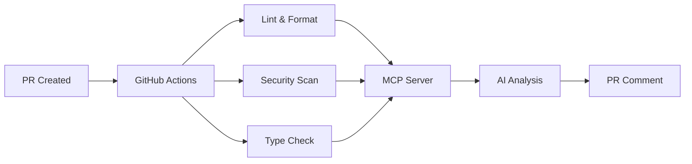

# GitHub PR Automation Suite

A comprehensive, easy-to-configure GitHub PR automation system for Typescript/Javascript projects with linting, formatting, security scanning, and AI-powered code reviews via an MCP server.

## Features

- **Comprehensive Linting**: ESLint with support for TypeScript, React, Next.js, YAML, JSON, and Markdown
- **Universal Formatting**: Prettier with file-type specific configurations
- **Security Scanning**: Automated security audits and dependency reviews
- **AI Code Reviews**: Intelligent code analysis using Claude or GPT-4 via MCP server
- **Performance Optimized**: Caching, parallel jobs, and efficient workflows
- **Highly Configurable**: Easy customization for different project types
- **Detailed Reporting**: Comprehensive analysis summaries and actionable feedback

## Architecture



## Quick Start

### 1. Clone and Install

```bash
git clone <your-repo>
cd github-pr-automation
npm install
```

### 2. Configure for Your Project

The system works out-of-the-box for most TypeScript/JavaScript projects. For customization:

- **ESLint**: Modify `.eslintrc.yml`
- **Prettier**: Update `.prettierrc`
- **TypeScript**: Adjust `tsconfig.json`
- **Workflow**: Edit `.github/workflows/pr-reviewer.yaml`

### 3. Set Up AI Reviews (Optional)

Follow the [MCP Setup Guide](./MCP_SETUP_GUIDE.md) to enable AI-powered code reviews.

### 4. GitHub Repository Setup

Add these secrets to your GitHub repository:

```
ANTHROPIC_API_KEY=your_key_here  # For Claude AI
OPENAI_API_KEY=your_key_here     # For GPT-4
MCP_SERVER_URL=https://your-server.com  # Your MCP server URL
```

## Project Structure

```
github-pr-automation/
├── .github/workflows/
│   └── pr-reviewer.yaml          # Main workflow
├── .eslintrc.yml                 # ESLint configuration
├── .prettierrc                   # Prettier configuration
├── tsconfig.json                 # TypeScript configuration
├── package.json                  # Dependencies and scripts
├── .gitignore                    # Git ignore rules
├── .eslintignore                 # ESLint ignore rules
├── .prettierignore               # Prettier ignore rules
├── MCP_SETUP_GUIDE.md           # AI setup instructions
└── README.md                     # This file
```

## Configuration

### Supported File Types

| Category | Extensions | Tools |
|----------|------------|-------|
| **JavaScript** | `.js`, `.jsx` | ESLint, Prettier |
| **TypeScript** | `.ts`, `.tsx` | ESLint, Prettier, TSC |
| **React/Next.js** | `.jsx`, `.tsx` | ESLint (React rules) |
| **Styles** | `.css`, `.scss`, `.less` | Prettier |
| **Data** | `.json`, `.jsonc`, `.yaml`, `.yml` | ESLint, Prettier |
| **Docs** | `.md`, `.mdx` | ESLint, Prettier |
| **Config** | Various config files | ESLint, Prettier |

### Framework Support

- **React** - Full support with hooks and JSX rules
- **Next.js** - Optimized rules and configurations
- **TypeScript** - Strict type checking and modern features
- **Node.js** - Server-side JavaScript support
- **Jest/Vitest** - Testing framework integration
- **Cypress** - E2E testing support

### Customization Examples

#### For a React-only project:
```yaml
# .eslintrc.yml - Remove Next.js specific rules
overrides:
  - files: ["*.js", "*.jsx", "*.ts", "*.tsx"]
    # Remove Next.js overrides
```

#### For a Node.js API:
```yaml
# .eslintrc.yml - Focus on Node.js
env:
  node: true
  browser: false  # Disable browser globals
```

#### For a vanilla JavaScript project:
```yaml
# .eslintrc.yml - Disable TypeScript rules
overrides:
  # Remove TypeScript-specific overrides
```

## 🔧 Available Scripts

| Script | Description |
|--------|-------------|
| `npm run lint` | Run ESLint with auto-fix |
| `npm run lint:check` | Check linting without fixing |
| `npm run format` | Format all files with Prettier |
| `npm run format:check` | Check formatting without fixing |
| `npm run type-check` | Run TypeScript type checking |
| `npm run validate` | Run all checks (lint + format + type) |
| `npm run test` | Run tests |

## Workflow Details

### Jobs Overview

1. **Setup** - Install dependencies with caching
2. **Lint & Format** - Code quality checks with auto-fixing
3. **Security Scan** - Vulnerability and dependency analysis
4. **AI Review** - Intelligent code analysis (optional)
5. **Summary** - Comprehensive results overview

### Auto-fixing Behavior

The workflow automatically:
- Fixes ESLint issues where possible
- Formats code with Prettier
- Commits changes back to the PR
- Runs final validation

### Security Features

- npm audit for vulnerability scanning
- CodeQL analysis for security issues
- Dependency review for supply chain security
- Permission-based access control

## AI Code Reviews

The AI reviewer provides:

- **Code Quality Analysis** - Best practices and patterns
- **Security Review** - Potential vulnerabilities
- **Performance Insights** - Optimization opportunities  
- **Style Consistency** - Adherence to project standards
- **Bug Detection** - Logic errors and edge cases
- **Documentation** - Missing or unclear documentation

### Sample AI Review

```markdown
## AI Code Review

**PR Summary:** Add user authentication system
**Author:** @developer
**Files Changed:** 8

### Analysis Results:

**Code Quality:** Excellent adherence to TypeScript best practices
**Security:** Consider rate limiting for login endpoint
**Performance:** Efficient database queries implemented
**Testing:** Missing unit tests for auth middleware

### Specific Recommendations:

1. **Security Enhancement**: Add rate limiting to prevent brute force attacks
2. **Error Handling**: Implement proper error boundaries in React components
3. **Type Safety**: Consider using branded types for user IDs
4. **Documentation**: Add JSDoc comments for public API methods

**Overall Score:** 8/10 - Great work! Address the security and testing concerns before merging.
```

## Customization Guide

### Adding New File Types

1. **Update ESLint config** (`.eslintrc.yml`):
```yaml
overrides:
  - files: ["*.newext"]
    parser: "new-parser"
    plugins: ["new-plugin"]
```

2. **Update Prettier config** (`.prettierrc`):
```json
{
  "overrides": [
    {
      "files": ["*.newext"],
      "options": { "tabWidth": 4 }
    }
  ]
}
```

3. **Update package.json scripts**:
```json
{
  "scripts": {
    "lint": "eslint . --ext .js,.jsx,.ts,.tsx,.newext"
  }
}
```

### Custom Rules

Add project-specific rules to `.eslintrc.yml`:

```yaml
rules:
  # Custom rules for your project
  "no-console": "error"  # Strict no console.log
  "prefer-const": "error"  # Enforce const usage
  "custom-rule/no-deprecated-api": "warn"  # Custom plugin rule
```

### Environment-Specific Configs

Create environment-specific configurations:

```yaml
# .eslintrc.production.yml
extends: ./.eslintrc.yml
rules:
  no-console: "error"  # Stricter in production
  no-debugger: "error"
```

## Monitoring and Analytics

### GitHub Actions Insights

- View workflow run history
- Monitor success/failure rates
- Track performance metrics
- Analyze bottlenecks

### Code Quality Metrics

- ESLint error/warning trends
- Code coverage reports
- Security vulnerability counts
- Dependency health scores

## Troubleshooting

### Common Issues

**ESLint fails on new file types:**
```bash
# Add the file extension to the lint script
"lint": "eslint . --ext .js,.jsx,.ts,.tsx,.vue"
```

**Prettier conflicts with ESLint:**
```bash
# Ensure prettier is last in extends array
extends: ["eslint:recommended", "prettier"]
```

**TypeScript errors in JavaScript files:**
```yaml
# Separate JS and TS configurations
overrides:
  - files: ["*.js"]
    rules:
      "@typescript-eslint/no-var-requires": "off"
```

**Workflow fails on large PRs:**
```yaml
# Increase timeout and add resource limits
jobs:
  lint-and-format:
    timeout-minutes: 30
```

### Debug Mode

Enable debug logging:
```yaml
# In GitHub Actions workflow
- name: Debug ESLint
  run: DEBUG=eslint:* npm run lint
```

## Contributing

1. Fork the repository
2. Create a feature branch
3. Make your changes
4. Run the validation: `npm run validate`
5. Submit a pull request

The automation will review your PR! 🤖

## License

MIT License - see [LICENSE](LICENSE) file for details.

## Acknowledgments

- ESLint community for comprehensive linting
- Prettier team for consistent formatting
- GitHub Actions for CI/CD platform
- Anthropic/OpenAI for AI capabilities
- Open source contributors

---

**To automate your PRs:**

Start by creating a pull request to test the system, or dive into the [MCP Setup Guide](./MCP_SETUP_GUIDE.md) for AI-powered reviews!