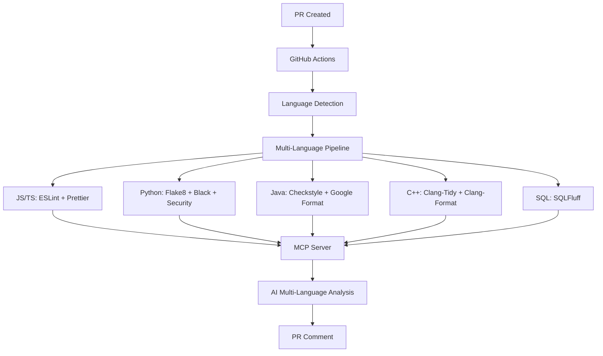

# Watchdog

Watchdog is a comprehensive, plug-and-play, multi-language GitHub PR automation
system supporting JavaScript/TypeScript, Python, Java, C++, and SQL with
intelligent linting, formatting, security scanning, and AI-powered code reviews
via an MCP server.

## Features

- **Multi-Language Support**: JavaScript/TypeScript, Python, Java, C++, and SQL
- **Comprehensive Linting**: ESLint, Flake8, Checkstyle, Clang-Tidy, SQLFluff
  with framework-specific rules
- **Universal Formatting**: Prettier, Black+isort, Google Java Format,
  Clang-Format, SQLFluff
- **Security Scanning**: Automated security audits, dependency reviews, and
  vulnerability scanning
- **AI Code Reviews**: Intelligent multi-language code analysis using Claude or
  OpenAI via MCP server
- **Performance Optimized**: Intelligent language detection, caching, parallel
  jobs, and efficient workflows
- **Zero Configuration**: Automatic tool detection with graceful degradation
- **Detailed Reporting**: Comprehensive analysis summaries and actionable
  feedback across all languages

## Tech Stack

### Core Technologies

- **GitHub Actions** - CI/CD automation and workflow orchestration
- **Node.js** - JavaScript runtime for tooling and scripts
- **Python** - Backend services and AI integration
- **Docker** - Containerization for MCP servers
- **TypeScript** - Type-safe JavaScript development

### Language-Specific Tools

- **JavaScript/TypeScript**: ESLint, Prettier, TypeScript Compiler
- **Python**: Flake8, Black, isort, MyPy, Bandit, Safety
- **Java**: Checkstyle, Google Java Format
- **C++**: Clang-Tidy, Clang-Format
- **SQL**: SQLFluff

### AI & Machine Learning

- **Claude 4 Sonnet** (`claude-sonnet-4-20250514`) - Primary AI model for code
  analysis
- **GPT-5** - Alternative AI model for code reviews
- **MCP (Model Context Protocol)** - AI server communication protocol
- **FastAPI** - Python web framework for MCP server
- **Express.js** - Node.js web framework for MCP server

### Security & Quality

- **CodeQL** - GitHub's semantic code analysis
- **Dependency Review** - Supply chain security
- **npm audit** - Node.js vulnerability scanning
- **Bandit** - Python security linting
- **Safety** - Python dependency vulnerability checking

### Infrastructure & Deployment

- **Docker Compose** - Multi-container orchestration
- **GitHub Secrets** - Secure credential management
- **Cloud Platforms** - Railway, Heroku, AWS, GCP support

## Architecture



## Quick Start

### 1. Clone and Install

```bash
git clone https://github.com/itsgeorgema/watchdog.git
cd watchdog
npm install
```

### 2. Configure for Your Project

The system works out-of-the-box for multi-language projects. It automatically
detects and processes:

- **JavaScript/TypeScript**: `.eslintrc.yml`, `.prettierrc`, `tsconfig.json`
- **Python**: `.flake8`, `pyproject.toml` (Black, isort, MyPy)
- **Java**: `checkstyle.xml` (Google Style Guide)
- **C++**: `.clang-format`, `.clang-tidy` (Google Style)
- **SQL**: `.sqlfluff` (PostgreSQL dialect)
- **Workflow**: `.github/workflows/pr-reviewer.yaml`

### 3. Set Up AI Reviews (Optional)

Follow the [MCP Setup Guide](./MCP_SETUP_GUIDE.md) to enable AI-powered code
reviews.

### 4. GitHub Repository Setup

Add these secrets to your GitHub repository:

```
ANTHROPIC_API_KEY=your_key_here  # For Claude AI
OPENAI_API_KEY=your_key_here     # For GPT-4
MCP_SERVER_URL=https://your-server.com  # Your MCP server URL
```

## Project Structure

```
watchdog/
├── .github/workflows/
│   └── pr-reviewer.yaml          # Multi-language workflow
├── .eslintrc.yml                 # JavaScript/TypeScript linting
├── .prettierrc                   # JavaScript/TypeScript formatting
├── tsconfig.json                 # TypeScript configuration
├── .flake8                       # Python linting (Flake8)
├── pyproject.toml                # Python formatting (Black, isort, MyPy)
├── checkstyle.xml                # Java linting (Google Style)
├── .clang-format                 # C++ formatting (Google Style)
├── .clang-tidy                   # C++ linting (comprehensive)
├── .sqlfluff                     # SQL linting and formatting
├── package.json                  # Dependencies and scripts
├── .gitignore                    # Multi-language ignore rules
├── .eslintignore                 # ESLint ignore rules
├── .prettierignore               # Prettier ignore rules
├── MCP_SETUP_GUIDE.md           # AI setup instructions
├── MULTI_LANGUAGE_SETUP.md      # Multi-language configuration guide
└── README.md                     # This file
```

## Configuration

### Supported File Types

| Category       | Extensions                         | Tools                                      |
| -------------- | ---------------------------------- | ------------------------------------------ |
| **JavaScript** | `.js`, `.jsx`                      | ESLint, Prettier                           |
| **TypeScript** | `.ts`, `.tsx`                      | ESLint, Prettier, TSC                      |
| **Python**     | `.py`                              | Flake8, Black, isort, MyPy, Bandit, Safety |
| **Java**       | `.java`                            | Checkstyle, Google Java Format             |
| **C/C++**      | `.c`, `.cpp`, `.h`, `.hpp`         | Clang-Tidy, Clang-Format                   |
| **SQL**        | `.sql`                             | SQLFluff (lint + format)                   |
| **Styles**     | `.css`, `.scss`, `.less`           | Prettier                                   |
| **Data**       | `.json`, `.jsonc`, `.yaml`, `.yml` | ESLint, Prettier                           |
| **Docs**       | `.md`, `.mdx`                      | ESLint, Prettier                           |
| **Config**     | Various config files               | ESLint, Prettier                           |

### Framework Support

- **React/Next.js** - Full support with hooks, JSX rules, and optimized
  configurations
- **TypeScript** - Strict type checking and modern features
- **Node.js** - Server-side JavaScript support
- **Python Frameworks** - Django, Flask, FastAPI compatible
- **Java Frameworks** - Spring Boot, Maven, Gradle support
- **C++ Standards** - C++11/14/17/20 support with modern best practices
- **SQL Dialects** - PostgreSQL, MySQL, SQLite, and more
- **Testing** - Jest/Vitest, pytest, JUnit, Google Test integration

### Customization Examples

#### For a React-only project:

```yaml
# .eslintrc.yml - Remove Next.js specific rules
overrides:
  - files: ['*.js', '*.jsx', '*.ts', '*.tsx']
    # Remove Next.js overrides
```

#### For a Node.js API:

```yaml
# .eslintrc.yml - Focus on Node.js
env:
  node: true
  browser: false # Disable browser globals
```

#### For a vanilla JavaScript project:

```yaml
# .eslintrc.yml - Disable TypeScript rules
overrides:
  # Remove TypeScript-specific overrides
```

## 🔧 Available Scripts

| Script                 | Description                                       |
| ---------------------- | ------------------------------------------------- |
| `npm run lint`         | Run linting for all detected languages            |
| `npm run lint:check`   | Check linting without fixing for all languages    |
| `npm run lint:js`      | JavaScript/TypeScript linting only                |
| `npm run lint:python`  | Python linting (Flake8) only                      |
| `npm run lint:java`    | Java linting (Checkstyle) only                    |
| `npm run lint:cpp`     | C++ linting (Clang-Tidy) only                     |
| `npm run lint:sql`     | SQL linting (SQLFluff) only                       |
| `npm run format`       | Format all files in all detected languages        |
| `npm run format:check` | Check formatting without fixing for all languages |
| `npm run type-check`   | Run TypeScript type checking                      |
| `npm run validate`     | Run all checks (lint + format + type)             |
| `npm run test`         | Run tests                                         |

## Workflow Details

### Jobs Overview

1. **Setup** - Install multi-language runtimes and tools with caching
2. **Lint & Format** - Multi-language code quality checks with auto-fixing
3. **Security Scan** - Vulnerability and dependency analysis (Python, Node.js)
4. **AI Review** - Intelligent multi-language code analysis (optional)
5. **Summary** - Comprehensive results overview across all languages

### Auto-fixing Behavior

The workflow automatically:

- Detects languages present in the repository
- Fixes linting issues where possible (ESLint, Black, Google Java Format,
  Clang-Format, SQLFluff)
- Formats code consistently across all languages
- Runs security scans (Python: Bandit + Safety, Node.js: npm audit)
- Commits changes back to the PR with descriptive messages
- Runs final validation across all languages

### Security Features

- **Multi-language vulnerability scanning**: npm audit (Node.js), Bandit
  (Python), Safety (Python)
- **CodeQL analysis**: Security issues detection across languages
- **Dependency review**: Supply chain security for all package managers
- **Permission-based access control**: Minimal required permissions per job
- **Secrets management**: Zero hardcoded secrets across all configurations

## AI Code Reviews

The AI reviewer provides language-specific analysis:

- **Code Quality Analysis** - Best practices and patterns for each language
- **Security Review** - Language-specific vulnerability detection
- **Performance Insights** - Optimization opportunities per language
- **Style Consistency** - Adherence to language-specific standards (Google
  Style, PEP 8, etc.)
- **Bug Detection** - Logic errors and edge cases across all languages
- **Documentation** - Missing or unclear documentation (JSDoc, docstrings,
  Javadoc)
- **Framework Best Practices** - React patterns, Django security, Spring Boot
  optimizations

### Sample AI Review

```markdown
## AI Code Review

**PR Summary:** Add multi-language user authentication system **Author:**
@developer **Files Changed:** 12 (Python backend, React frontend, SQL
migrations, Java services)

### Analysis Results:

**Python Backend (FastAPI):**

- Code Quality: Excellent PEP 8 compliance and type hints usage
- Security: Consider rate limiting and input validation improvements
- Performance: Efficient async/await patterns implemented

**React Frontend (TypeScript):**

- Code Quality: Great TypeScript usage and React best practices
- Security: Implement proper CSRF protection
- Performance: Consider memoization for expensive computations

**SQL Migrations:**

- Code Quality: Well-structured schema changes
- Security: Proper indexing and constraints applied
- Performance: Efficient migration strategy

**Java Microservices:**

- Code Quality: Good adherence to Google Java Style
- Security: Add input validation annotations
- Performance: Consider connection pooling optimizations

### Specific Recommendations:

1. **Multi-language Security**: Implement consistent auth across all services
2. **Error Handling**: Standardize error responses across Python/Java APIs
3. **Type Safety**: Use branded types in TypeScript and proper generics in Java
4. **Documentation**: Add comprehensive API documentation for all endpoints

**Overall Score:** 9/10 - Excellent multi-language implementation! Minor
security enhancements recommended.
```

## Customization Guide

### Adding New File Types

1. **Update ESLint config** (`.eslintrc.yml`):

```yaml
overrides:
  - files: ['*.newext']
    parser: 'new-parser'
    plugins: ['new-plugin']
```

2. **Update Prettier config** (`.prettierrc`):

```json
{
  "overrides": [
    {
      "files": ["*.newext"],
      "options": { "tabWidth": 4 }
    }
  ]
}
```

3. **Update package.json scripts**:

```json
{
  "scripts": {
    "lint": "eslint . --ext .js,.jsx,.ts,.tsx,.newext"
  }
}
```

### Custom Rules

Add project-specific rules to `.eslintrc.yml`:

```yaml
rules:
  # Custom rules for your project
  'no-console': 'error' # Strict no console.log
  'prefer-const': 'error' # Enforce const usage
  'custom-rule/no-deprecated-api': 'warn' # Custom plugin rule
```

### Environment-Specific Configs

Create environment-specific configurations:

```yaml
# .eslintrc.production.yml
extends: ./.eslintrc.yml
rules:
  no-console: 'error' # Stricter in production
  no-debugger: 'error'
```

## Monitoring and Analytics

### GitHub Actions Insights

- View workflow run history
- Monitor success/failure rates
- Track performance metrics
- Analyze bottlenecks

### Code Quality Metrics

- ESLint error/warning trends
- Code coverage reports
- Security vulnerability counts
- Dependency health scores

## Troubleshooting

### Common Issues

**ESLint fails on new file types:**

```bash
# Add the file extension to the lint script
"lint": "eslint . --ext .js,.jsx,.ts,.tsx,.vue"
```

**Prettier conflicts with ESLint:**

```bash
# Ensure prettier is last in extends array
extends: ["eslint:recommended", "prettier"]
```

**TypeScript errors in JavaScript files:**

```yaml
# Separate JS and TS configurations
overrides:
  - files: ['*.js']
    rules:
      '@typescript-eslint/no-var-requires': 'off'
```

**Workflow fails on large PRs:**

```yaml
# Increase timeout and add resource limits
jobs:
  lint-and-format:
    timeout-minutes: 30
```

### Debug Mode

Enable debug logging:

```yaml
# In GitHub Actions workflow
- name: Debug ESLint
  run: DEBUG=eslint:* npm run lint
```

## Contributing

1. Fork the repository
2. Create a feature branch
3. Make your changes
4. Run the validation: `npm run validate`
5. Submit a pull request

The automation will review your PR! 🤖

## License

MIT License - see [LICENSE](LICENSE) file for details.

## Acknowledgments

- ESLint community for comprehensive linting
- Prettier team for consistent formatting
- GitHub Actions for CI/CD platform
- Anthropic/OpenAI for AI capabilities
- Open source contributors

---

**To automate your PRs with Watchdog:**

1. **Quick Start**: Create a pull request to test the multi-language system
2. **AI Reviews**: Follow the [MCP Setup Guide](./MCP_SETUP_GUIDE.md) for
   intelligent code reviews
3. **Multi-Language Setup**: Check the
   [Multi-Language Setup Guide](./MULTI_LANGUAGE_SETUP.md) for advanced
   configuration

Watchdog automatically detects your project's languages and applies the
appropriate tools!
